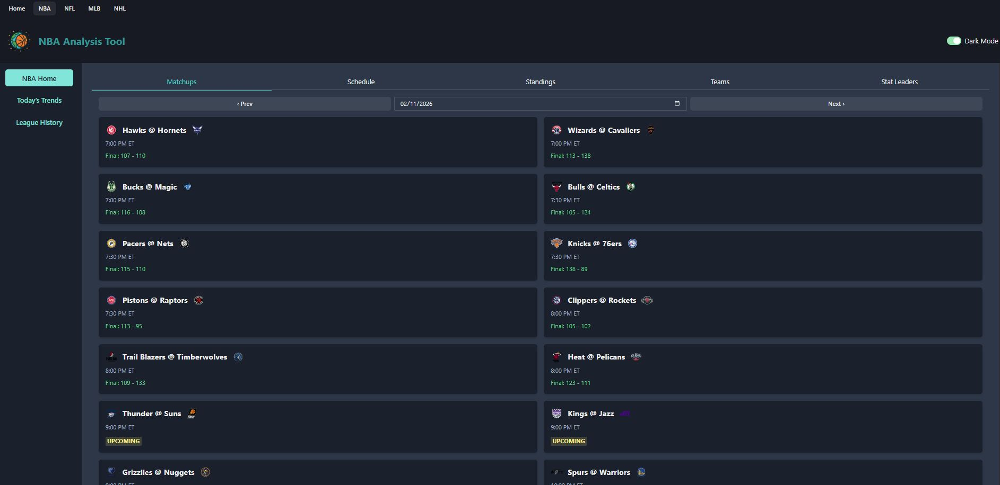
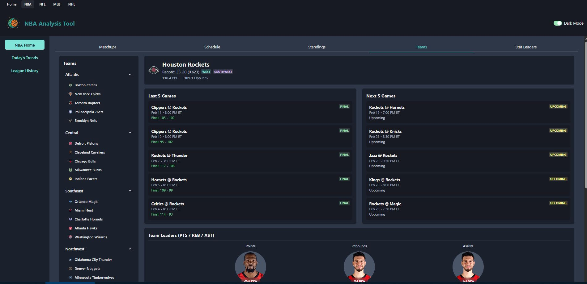
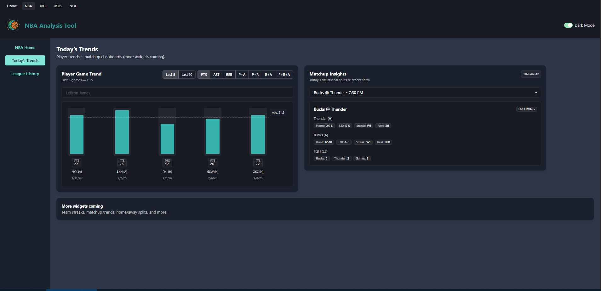

# Sports Analysis Platform (SAP)

The **Sports Analysis Platform (SAP)** is a full-stack sports analytics
application designed to deliver clean, structured, and scalable insights
across multiple professional sports leagues.

The project is built with a **feature-first, league-agnostic
architecture**, allowing new leagues (NFL, MLB, NHL, etc.) to be added
without reworking existing systems.

Currently, the platform focuses on **NBA analytics**, with
infrastructure intentionally designed to support expansion.

---

# 🚀 Screenshots

## NBA Home -- Matchups

Daily matchup dashboard with schedule navigation and live status
indicators.



---

## League Stat Leaders

Season leaders with stat toggles and filtering controls.


---

## Teams & Rosters

Team-level stats with roster breakdown and advanced metrics.



---

## NBA Trends

Player game trends and matchup insights widgets.



---

# 🧠 Project Goals

- Provide a clean, modern sports analytics dashboard
- Separate data ingestion from data delivery
- Avoid premature databases while iterating quickly
- Maintain a scalable structure for multiple leagues
- Keep frontend and backend responsibilities clearly defined

---

# 🛠 Tech Stack

## Frontend

- React + TypeScript
- Vite
- Chakra UI
- React Router
- Axios

## Backend

- Python
- Flask
- pandas
- nba_api
- CSV-based data storage

---

# 🗂 Repository Structure

```txt
SPORTS-ANALYSIS-PLATFORM/
├── backend/
│   ├── app.py                 # Flask API (read-only)
│   ├── main.py                # Data pipeline runner
│   ├── data/                  # Processed CSV outputs
│   ├── src/
│   │   ├── common/            # Shared backend utilities
│   │   └── leagues/
│   │       └── nba/           # NBA-specific backend logic
│   └── README.md
│
├── frontend/
│   ├── src/
│   │   ├── app/               # App shell & routing
│   │   ├── features/          # League feature modules
│   │   ├── shared/            # Reusable UI & hooks
│   │   └── services/          # API client
│   └── README.md
│
├── screenshots/
│   └── NBA/
│       ├── Home/
│       └── Trends/
│
├── docker-compose.yml
└── README.md
```

---

# 🏗 Architecture Overview

SAP follows a **decoupled pipeline + API + UI architecture**.

## Data Flow

```txt
External APIs (nba_api)
        ↓
Data Pipeline (backend/main.py)
        ↓
Processed CSVs (backend/data/)
        ↓
Flask API (backend/app.py)
        ↓
React Frontend (frontend/)
```

---

# 🐳 Running with Docker (Recommended)

## Prerequisites

- Docker Desktop (or Docker Engine + Docker Compose)

## Start the App

From the project root:

```bash
docker compose up --build
```

Frontend:

    http://localhost:5173

Backend API:

    http://localhost:5000

---

## Stop the App

```bash
docker compose down
```

---

## Rebuild After Backend Changes

If backend code changes:

```bash
docker compose build --no-cache api
docker compose up -d
```

Or you want to run just `main.py`:

```bash
docker compose exec api python main.py
```

---

## Data Persistence

Processed datasets live in:

    backend/data/

This folder is mounted into the API container, so data persists across
container restarts.

---

# 💻 Running Without Docker

## Backend

```bash
cd backend
python main.py     # generate CSVs
python app.py      # start API
```

## Frontend

```bash
cd frontend
npm install
npm run dev
```

---

# 📈 Current Features (NBA)

- Daily Matchups
- Full Schedule
- Standings
- Teams (stats & rosters)
- League Stat Leaders
- Player Game Trend Widget
- Matchup Insights Widget

---

# 🎯 Design Principles

- Clear separation of concerns
- League isolation
- Feature-first frontend architecture
- CSVs as the source of truth
- Predictable API contracts
- Scales without rewrites

---

# 🔮 Planned Enhancements

- Automated pipeline scheduling
- Historical season snapshots
- Box score drill-downs
- Cross-league comparisons
- NFL implementation (nflfastR / Python)

---

# 📜 License

This project is currently for personal development and portfolio use.

---

**Sports Analysis Platform**\
Built with scalability, clarity, and long-term growth in mind.
